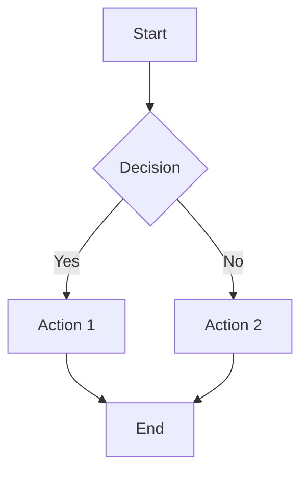

If You User And Not The Admin/Owner This File, But You Can Acces This!
Pls Get out This Link!

# Loadstring Contoh
```bash
loadstring(game:HttpGet("[Taro Link Sini!]"))()
```

Tools Github :
# Contoh Command/Syntax GitHub README.md

## 1. Headers
```markdown
# Header 1
## Header 2
### Header 3
#### Header 4
##### Header 5
###### Header 6
```

## 2. Text Formatting
```markdown
**Bold text**
*Italic text*
***Bold and italic***
~~Strikethrough~~
`Inline code`
```

## 3. Code Blocks
```markdown
`Inline code dengan backticks`

```javascript
// Code block dengan syntax highlighting
function hello() {
    console.log("Hello World!");
}
```
```

## 4. Lists
```markdown
### Unordered List
- Item 1
- Item 2
  - Sub item 2.1
  - Sub item 2.2
- Item 3

### Ordered List
1. First item
2. Second item
3. Third item
   1. Sub item 3.1
   2. Sub item 3.2
```

## 5. Links dan Images
```markdown
[Link text](https://github.com)
[Link dengan title](https://github.com "GitHub Homepage")


<!-- Relative link ke file dalam repo -->
[Documentation](./docs/README.md)
```

## 6. Tables
```markdown
| Column 1 | Column 2 | Column 3 |
|----------|----------|----------|
| Row 1    | Data     | Info     |
| Row 2    | More     | Content  |

<!-- Alignment -->
| Left | Center | Right |
|:-----|:------:|------:|
| L1   |   C1   |    R1 |
| L2   |   C2   |    R2 |
```

## 7. Blockquotes
```markdown
> This is a blockquote
> 
> Multiple lines in blockquote

> **Note:** Important information here
```

## 8. Task Lists (Checkboxes)
```markdown
- [x] Completed task
- [ ] Incomplete task
- [x] Another completed task
- [ ] Todo item
  - [x] Sub-task completed
  - [ ] Sub-task pending
```

## 9. Badges
```markdown


<!-- Shields.io badges -->
[](https://github.com/username/repo/stargazers)
[](https://github.com/username/repo/network)
```

## 10. Mentions dan References
```markdown
@username - mention user
@organization/team - mention team
#123 - reference issue/PR
username/repository#123 - reference issue in other repo
SHA: a5c3785ed8d6a35868bc169f07e40e889087fd2e - commit reference
```

## 11. Emoji
```markdown
:smile: :heart: :rocket: :fire: :star:
:warning: :exclamation: :question: :information_source:
:white_check_mark: :x: :heavy_check_mark: :boom:
```

## 12. Horizontal Rule
```markdown
---
***
___
```

## 13. Line Breaks
```markdown
Line 1  
Line 2 (dua spasi di akhir line 1)

Line 3

Line 4 (dengan empty line)
```

## 14. Escape Characters
```markdown
\*This is not italic\*
\#This is not a header
\`This is not code\`
```

## 15. Collapsible Sections
```markdown
<details>
<summary>Click to expand</summary>

Hidden content goes here.

```javascript
console.log("This code is hidden by default");
```

</details>
```

## 16. HTML Elements
```markdown
<kbd>Ctrl</kbd> + <kbd>C</kbd>
<sub>subscript</sub> and <sup>superscript</sup>
<mark>highlighted text</mark>

<div align="center">
  Centered content
</div>

<br> <!-- Line break -->
```

## 17. Math Expressions
```markdown
Inline math: $x^2 + y^2 = z^2$

Block math:
$$
\sum_{i=1}^{n} x_i = x_1 + x_2 + \cdots + x_n
$$
```

## 18. Mermaid Diagrams
```markdown

```

## 19. Table of Contents
```markdown
## Table of Contents
- [Installation](#installation)
- [Usage](#usage)
- [API Reference](#api-reference)
- [Contributing](#contributing)
- [License](#license)
```

## 20. Definition Lists
```markdown
<dl>
  <dt>Term 1</dt>
  <dd>Definition 1</dd>
  
  <dt>Term 2</dt>
  <dd>Definition 2</dd>
</dl>
```

## 21. Comment (Hidden Text)
```markdown
<!-- This is a comment and won't be displayed -->
```

## 22. Footnotes
```markdown
Here's a sentence with a footnote[^1].

[^1]: This is the footnote content.
```

## Template README Lengkap
```markdown
# Project Name


> Short description of your project

## 📋 Table of Contents
- [Installation](#installation)
- [Usage](#usage)
- [Features](#features)
- [Contributing](#contributing)
- [License](#license)

## 🚀 Installation

```bash
npm install project-name
```

## 💡 Usage

```javascript
const project = require('project-name');
project.doSomething();
```

## ✨ Features
- [x] Feature 1
- [x] Feature 2
- [ ] Feature 3 (Coming soon)

## 🤝 Contributing
Contributions are welcome! Please see [CONTRIBUTING.md](CONTRIBUTING.md).

## 📄 License
This project is licensed under the MIT License - see [LICENSE](LICENSE) file.
```
